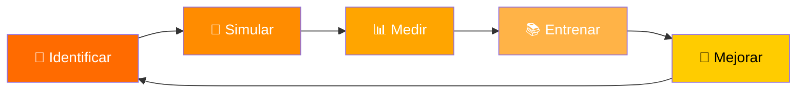
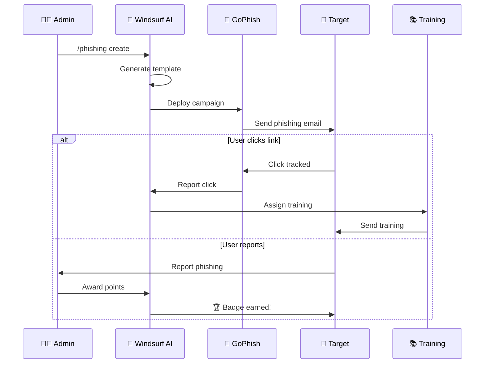

# 🟠 ORANGE TEAM - Security Awareness Platform

<div align="center">

```
 ██████╗ ██████╗  █████╗ ███╗   ██╗ ██████╗ ███████╗    ████████╗███████╗ █████╗ ███╗   ███╗
██╔═══██╗██╔══██╗██╔══██╗████╗  ██║██╔════╝ ██╔════╝    ╚══██╔══╝██╔════╝██╔══██╗████╗ ████║
██║   ██║██████╔╝███████║██╔██╗ ██║██║  ███╗█████╗         ██║   █████╗  ███████║██╔████╔██║
██║   ██║██╔══██╗██╔══██║██║╚██╗██║██║   ██║██╔══╝         ██║   ██╔══╝  ██╔══██║██║╚██╔╝██║
╚██████╔╝██║  ██║██║  ██║██║ ╚████║╚██████╔╝███████╗       ██║   ███████╗██║  ██║██║ ╚═╝ ██║
 ╚═════╝ ╚═╝  ╚═╝╚═╝  ╚═╝╚═╝  ╚═══╝ ╚═════╝ ╚══════╝       ╚═╝   ╚══════╝╚═╝  ╚═╝╚═╝     ╚═╝
                                                                                            
        ███████╗███████╗ ██████╗██╗   ██╗██████╗ ██╗████████╗██╗   ██╗                      
        ██╔════╝██╔════╝██╔════╝██║   ██║██╔══██╗██║╚══██╔══╝╚██╗ ██╔╝                      
        ███████╗█████╗  ██║     ██║   ██║██████╔╝██║   ██║    ╚████╔╝                       
        ╚════██║██╔══╝  ██║     ██║   ██║██╔══██╗██║   ██║     ╚██╔╝                        
        ███████║███████╗╚██████╗╚██████╔╝██║  ██║██║   ██║      ██║                         
        ╚══════╝╚══════╝ ╚═════╝ ╚═════╝ ╚═╝  ╚═╝╚═╝   ╚═╝      ╚═╝                         
                                                                                            
         █████╗ ██╗    ██╗ █████╗ ██████╗ ███████╗███╗   ██╗███████╗███████╗███████╗        
        ██╔══██╗██║    ██║██╔══██╗██╔══██╗██╔════╝████╗  ██║██╔════╝██╔════╝██╔════╝        
        ███████║██║ █╗ ██║███████║██████╔╝█████╗  ██╔██╗ ██║█████╗  ███████╗███████╗        
        ██╔══██║██║███╗██║██╔══██║██╔══██╗██╔══╝  ██║╚██╗██║██╔══╝  ╚════██║╚════██║        
        ██║  ██║╚███╔███╔╝██║  ██║██║  ██║███████╗██║ ╚████║███████╗███████║███████║        
        ╚═╝  ╚═╝ ╚══╝╚══╝ ╚═╝  ╚═╝╚═╝  ╚═╝╚══════╝╚═╝  ╚═══╝╚══════╝╚══════╝╚══════╝        
```

**🛡️ Plataforma Integral de Concientización en Seguridad + Windsurf AI**

[](.)
[](.)
[](.)
[](.)
[](.)
[](.)

</div>

---

## 📋 Tabla de Contenidos

- [🎯 Objetivo](#-objetivo)
- [🏗️ Arquitectura](#️-arquitectura)
- [🚀 Quick Start](#-quick-start)
- [📚 Programas de Awareness](#-programas-de-awareness)
- [🎣 Simulaciones de Phishing](#-simulaciones-de-phishing)
- [📊 Métricas de Efectividad](#-métricas-de-efectividad)
- [🎮 Gamification](#-gamification)
- [🔧 Herramientas Integradas](#-herramientas-integradas)
- [🤖 Windsurf AI Integration](#-windsurf-ai-integration)
- [💜 Purple Team Integration](#-purple-team-integration)
- [📁 Estructura del Proyecto](#-estructura-del-proyecto)

---

## 🎯 Objetivo

**ORANGE TEAM** se enfoca en el **factor humano** de la seguridad:



| Componente | Descripción |
|------------|-------------|
| **🎣 Phishing Simulations** | Campañas controladas para evaluar susceptibilidad |
| **📚 Security Training** | Programas de capacitación personalizados |
| **📊 Metrics & Analytics** | Medición de efectividad y progreso |
| **🎮 Gamification** | Elementos de juego para engagement |
| **🤖 AI-Powered** | Automatización inteligente con Windsurf |

---

## 🏗️ Arquitectura

```
┌─────────────────────────────────────────────────────────────────────────────┐
│                        🟠 ORANGE TEAM PLATFORM                              │
├─────────────────────────────────────────────────────────────────────────────┤
│                                                                             │
│  ┌─────────────┐    ┌─────────────┐    ┌─────────────┐    ┌─────────────┐  │
│  │   🎣        │    │   📚        │    │   📊        │    │   🎮        │  │
│  │  PHISHING   │───▶│  TRAINING   │───▶│  METRICS    │───▶│  GAMIFY     │  │
│  │  ENGINE     │    │  PLATFORM   │    │  DASHBOARD  │    │  SYSTEM     │  │
│  └─────────────┘    └─────────────┘    └─────────────┘    └─────────────┘  │
│         │                  │                  │                  │         │
│         └──────────────────┴──────────────────┴──────────────────┘         │
│                                    │                                        │
│                          ┌─────────▼─────────┐                             │
│                          │   🤖 WINDSURF AI  │                             │
│                          │   Orchestrator    │                             │
│                          └─────────┬─────────┘                             │
│                                    │                                        │
│         ┌──────────────────────────┼──────────────────────────┐            │
│         │                          │                          │            │
│  ┌──────▼──────┐           ┌───────▼───────┐          ┌───────▼───────┐   │
│  │   GoPhish   │           │  King Phisher │          │   Evilginx2   │   │
│  │   Server    │           │    Server     │          │    Proxy      │   │
│  └─────────────┘           └───────────────┘          └───────────────┘   │
│                                                                             │
├─────────────────────────────────────────────────────────────────────────────┤
│  💜 PURPLE TEAM INTEGRATION                                                 │
│  ┌─────────────┐    ┌─────────────┐    ┌─────────────┐    ┌─────────────┐  │
│  │ 🔴 Red Team │    │ 🔵 Blue Team│    │ 🟡 Yellow   │    │ 🟢 Green    │  │
│  │   Attacks   │    │   Defense   │    │   DevSecOps │    │   SIEM      │  │
│  └─────────────┘    └─────────────┘    └─────────────┘    └─────────────┘  │
└─────────────────────────────────────────────────────────────────────────────┘
```

---

## 🚀 Quick Start

### Instalación Rápida

```bash
# Clonar y configurar
git clone https://github.com/your-org/orangeteam-windsurf.git
cd orangeteam-windsurf

# Ejecutar instalador
chmod +x install.sh
./install.sh

# Activar entorno virtual
source venv/bin/activate

# Iniciar servicios
docker-compose up -d
```

### Comandos Windsurf

```bash
# En Windsurf, usa estos workflows:
/phishing    # Crear campaña de phishing
/training    # Generar material de training
/metrics     # Ver métricas de awareness
/campaign    # Gestionar campañas activas
/quiz        # Crear evaluaciones
```

---

## 📚 Programas de Awareness

### 🎓 Módulos de Capacitación

| Módulo | Duración | Nivel | Descripción |
|--------|----------|-------|-------------|
| **Phishing 101** | 30 min | 🟢 Básico | Identificación de correos maliciosos |
| **Social Engineering** | 45 min | 🟡 Intermedio | Técnicas de manipulación |
| **Password Security** | 20 min | 🟢 Básico | Gestión segura de contraseñas |
| **Data Protection** | 40 min | 🟡 Intermedio | Clasificación y manejo de datos |
| **Incident Response** | 60 min | 🔴 Avanzado | Qué hacer ante un incidente |
| **Mobile Security** | 25 min | 🟢 Básico | Seguridad en dispositivos móviles |
| **Remote Work** | 35 min | 🟡 Intermedio | Seguridad en trabajo remoto |
| **Insider Threats** | 50 min | 🔴 Avanzado | Amenazas internas |

### 📅 Calendario de Training

```
┌─────────────────────────────────────────────────────────────────┐
│                    📅 TRAINING CALENDAR 2024                    │
├─────────────────────────────────────────────────────────────────┤
│ Q1: Foundations                                                 │
│   ├── Enero:   Phishing 101 + Password Security                │
│   ├── Febrero: Social Engineering Basics                        │
│   └── Marzo:   Data Protection Fundamentals                     │
├─────────────────────────────────────────────────────────────────┤
│ Q2: Advanced Threats                                            │
│   ├── Abril:   Advanced Phishing Techniques                     │
│   ├── Mayo:    Ransomware Awareness                             │
│   └── Junio:   Business Email Compromise                        │
├─────────────────────────────────────────────────────────────────┤
│ Q3: Specialized Training                                        │
│   ├── Julio:   Mobile & IoT Security                            │
│   ├── Agosto:  Cloud Security Awareness                         │
│   └── Sept:    Incident Response Drills                         │
├─────────────────────────────────────────────────────────────────┤
│ Q4: Assessment & Reinforcement                                  │
│   ├── Octubre: Annual Security Assessment                       │
│   ├── Nov:     Remediation Training                             │
│   └── Dic:     Year-End Review & Certification                  │
└─────────────────────────────────────────────────────────────────┘
```

---

## 🎣 Simulaciones de Phishing

### 📧 Tipos de Campañas

```
┌──────────────────────────────────────────────────────────────────────────┐
│                        🎣 PHISHING CAMPAIGN TYPES                        │
├──────────────────────────────────────────────────────────────────────────┤
│                                                                          │
│  ┌────────────────┐  ┌────────────────┐  ┌────────────────┐             │
│  │  📧 EMAIL      │  │  💬 SMS        │  │  📞 VISHING    │             │
│  │  PHISHING      │  │  SMISHING      │  │  Voice Phish   │             │
│  │                │  │                │  │                │             │
│  │ • Credential   │  │ • Fake alerts  │  │ • IT Support   │             │
│  │ • Malware      │  │ • Prize scams  │  │ • Bank calls   │             │
│  │ • BEC          │  │ • Delivery     │  │ • Survey       │             │
│  └────────────────┘  └────────────────┘  └────────────────┘             │
│                                                                          │
│  ┌────────────────┐  ┌────────────────┐  ┌────────────────┐             │
│  │  🔗 SPEAR      │  │  🐋 WHALING    │  │  📱 QR CODE    │             │
│  │  PHISHING      │  │  Executive     │  │  QUISHING      │             │
│  │                │  │                │  │                │             │
│  │ • Targeted     │  │ • CEO Fraud    │  │ • Fake QR      │             │
│  │ • Research     │  │ • Wire fraud   │  │ • Redirect     │             │
│  │ • Personal     │  │ • M&A scams    │  │ • Credential   │             │
│  └────────────────┘  └────────────────┘  └────────────────┘             │
│                                                                          │
└──────────────────────────────────────────────────────────────────────────┘
```

### 🎯 Niveles de Dificultad

| Nivel | Indicadores | Objetivo |
|-------|-------------|----------|
| **🟢 Fácil** | Errores obvios, URLs sospechosas, mala gramática | Baseline assessment |
| **🟡 Medio** | Mejor diseño, URLs similares, contexto básico | Standard testing |
| **🔴 Difícil** | Diseño profesional, dominios lookalike, contexto específico | Advanced assessment |
| **⚫ Expert** | Spear phishing, información personal, timing perfecto | Red Team simulation |

### 📊 Workflow de Campaña



---

## 📊 Métricas de Efectividad

### 📈 KPIs Principales

```
┌─────────────────────────────────────────────────────────────────────────────┐
│                         📊 AWARENESS METRICS DASHBOARD                      │
├─────────────────────────────────────────────────────────────────────────────┤
│                                                                             │
│  ┌─────────────────┐  ┌─────────────────┐  ┌─────────────────┐             │
│  │   CLICK RATE    │  │  REPORT RATE    │  │ TRAINING COMP.  │             │
│  │                 │  │                 │  │                 │             │
│  │    ▼ 12.5%     │  │    ▲ 67.3%     │  │    ▲ 89.2%     │             │
│  │   (-3.2% MoM)  │  │   (+8.1% MoM)  │  │   (+2.4% MoM)  │             │
│  │   🎯 Goal: 5%  │  │   🎯 Goal: 80% │  │   🎯 Goal: 95% │             │
│  └─────────────────┘  └─────────────────┘  └─────────────────┘             │
│                                                                             │
│  ┌─────────────────────────────────────────────────────────────────────┐   │
│  │                    CLICK RATE TREND (12 MONTHS)                     │   │
│  │  25% ┤                                                              │   │
│  │      │ ██                                                           │   │
│  │  20% ┤ ██ ██                                                        │   │
│  │      │ ██ ██ ██                                                     │   │
│  │  15% ┤ ██ ██ ██ ██                                                  │   │
│  │      │ ██ ██ ██ ██ ██ ██                                            │   │
│  │  10% ┤ ██ ██ ██ ██ ██ ██ ██ ██                                      │   │
│  │      │ ██ ██ ██ ██ ██ ██ ██ ██ ██ ██ ██ ██                          │   │
│  │   5% ┤ ██ ██ ██ ██ ██ ██ ██ ██ ██ ██ ██ ██ ─ ─ ─ ─ ─ GOAL          │   │
│  │      └──────────────────────────────────────────────────────────    │   │
│  │        J  F  M  A  M  J  J  A  S  O  N  D                           │   │
│  └─────────────────────────────────────────────────────────────────────┘   │
│                                                                             │
│  ┌───────────────────────────────┐  ┌───────────────────────────────────┐  │
│  │  📊 BY DEPARTMENT             │  │  📊 BY CAMPAIGN TYPE              │  │
│  │                               │  │                                   │  │
│  │  Sales        ████████ 18.2%  │  │  Credential  ████████████ 22.1%  │  │
│  │  Marketing    ██████ 14.1%    │  │  Malware     ████████ 15.3%      │  │
│  │  Finance      █████ 11.3%     │  │  BEC         ██████ 12.8%        │  │
│  │  Engineering  ███ 7.2%        │  │  Spear       ████ 8.4%           │  │
│  │  IT           ██ 4.1%         │  │  Whaling     ██ 5.2%             │  │
│  │  Security     █ 1.2%          │  │  QR Code     ███ 6.7%            │  │
│  └───────────────────────────────┘  └───────────────────────────────────┘  │
│                                                                             │
└─────────────────────────────────────────────────────────────────────────────┘
```

### 📋 Métricas Detalladas

| Métrica | Descripción | Fórmula | Target |
|---------|-------------|---------|--------|
| **Click Rate** | % usuarios que hacen clic | Clicks / Emails Sent × 100 | < 5% |
| **Report Rate** | % usuarios que reportan | Reports / Emails Sent × 100 | > 80% |
| **Credential Submit** | % que envían credenciales | Submits / Clicks × 100 | < 2% |
| **Time to Report** | Tiempo promedio de reporte | Avg(Report Time - Send Time) | < 5 min |
| **Training Completion** | % que completan training | Completed / Assigned × 100 | > 95% |
| **Repeat Offenders** | % reincidentes | Repeat Clicks / Total Users × 100 | < 3% |
| **Security Score** | Puntuación general | Weighted average of all metrics | > 85 |

---

## 🎮 Gamification

### 🏆 Sistema de Puntos y Badges

```
┌─────────────────────────────────────────────────────────────────────────────┐
│                          🎮 GAMIFICATION SYSTEM                             │
├─────────────────────────────────────────────────────────────────────────────┤
│                                                                             │
│  🏆 BADGES                                                                  │
│  ┌─────────────┐ ┌─────────────┐ ┌─────────────┐ ┌─────────────┐           │
│  │ 🛡️ DEFENDER │ │ 🔍 SPOTTER  │ │ 🎓 SCHOLAR  │ │ 🏅 CHAMPION │           │
│  │             │ │             │ │             │ │             │           │
│  │ Report 10   │ │ Report 25   │ │ Complete    │ │ Top 10%     │           │
│  │ phishing    │ │ phishing    │ │ all modules │ │ quarterly   │           │
│  │ attempts    │ │ attempts    │ │             │ │             │           │
│  │             │ │             │ │             │ │             │           │
│  │ +100 pts    │ │ +250 pts    │ │ +500 pts    │ │ +1000 pts   │           │
│  └─────────────┘ └─────────────┘ └─────────────┘ └─────────────┘           │
│                                                                             │
│  ┌─────────────┐ ┌─────────────┐ ┌─────────────┐ ┌─────────────┐           │
│  │ ⚡ QUICK    │ │ 🎯 PERFECT  │ │ 🌟 MENTOR   │ │ 👑 LEGEND   │           │
│  │ RESPONDER   │ │ SCORE       │ │             │ │             │           │
│  │             │ │             │ │             │ │             │           │
│  │ Report in   │ │ 100% on all │ │ Help 5      │ │ 1 year no   │           │
│  │ < 2 minutes │ │ quizzes     │ │ colleagues  │ │ clicks      │           │
│  │             │ │             │ │             │ │             │           │
│  │ +150 pts    │ │ +300 pts    │ │ +400 pts    │ │ +2000 pts   │           │
│  └─────────────┘ └─────────────┘ └─────────────┘ └─────────────┘           │
│                                                                             │
│  📊 LEADERBOARD                                                             │
│  ┌─────────────────────────────────────────────────────────────────────┐   │
│  │  Rank  │  User              │  Points  │  Badges  │  Streak        │   │
│  │────────┼────────────────────┼──────────┼──────────┼────────────────│   │
│  │  🥇 1  │  Alice Johnson     │  4,250   │  🛡️🔍🎓🏅 │  45 days 🔥    │   │
│  │  🥈 2  │  Bob Smith         │  3,890   │  🛡️🔍🎓  │  32 days       │   │
│  │  🥉 3  │  Carol Williams    │  3,650   │  🛡️🔍⚡  │  28 days       │   │
│  │     4  │  David Brown       │  3,420   │  🛡️🎓   │  21 days       │   │
│  │     5  │  Eve Davis         │  3,180   │  🛡️🔍   │  18 days       │   │
│  └─────────────────────────────────────────────────────────────────────┘   │
│                                                                             │
│  🎁 REWARDS                                                                 │
│  ┌─────────────────────────────────────────────────────────────────────┐   │
│  │  Points  │  Reward                                                  │   │
│  │──────────┼──────────────────────────────────────────────────────────│   │
│  │  1,000   │  ☕ Coffee voucher                                       │   │
│  │  2,500   │  🎧 Company swag                                         │   │
│  │  5,000   │  🎫 Extra PTO day                                        │   │
│  │  10,000  │  🏆 Security Champion certificate + bonus                │   │
│  └─────────────────────────────────────────────────────────────────────┘   │
│                                                                             │
└─────────────────────────────────────────────────────────────────────────────┘
```

### 🎯 Challenges Mensuales

```python
MONTHLY_CHALLENGES = {
    "January": {
        "name": "New Year, New Security",
        "goal": "Complete password security module",
        "reward": 500,
        "badge": "🔐 Password Pro"
    },
    "February": {
        "name": "Love Your Data",
        "goal": "Report 5 phishing attempts",
        "reward": 300,
        "badge": "💝 Data Guardian"
    },
    # ... more challenges
}
```

---

## 🔧 Herramientas Integradas

### 🎣 Phishing Tools

| Herramienta | Descripción | Puerto | Status |
|-------------|-------------|--------|--------|
| **GoPhish** | Plataforma principal de phishing | 3333 | ✅ Integrado |
| **King Phisher** | Campañas avanzadas | 8443 | ✅ Integrado |
| **Evilginx2** | Proxy de phishing MitM | 443 | ✅ Integrado |
| **SET** | Social Engineering Toolkit | - | ✅ Integrado |
| **BeEF** | Browser Exploitation Framework | 3000 | ✅ Integrado |

### 📚 Training Platforms

| Plataforma | Uso | Integración |
|------------|-----|-------------|
| **Custom LMS** | Módulos internos | API REST |
| **KnowBe4** | Contenido premium | Webhook |
| **Proofpoint** | Simulaciones | API |
| **Mimecast** | Email security | SIEM |

### 📊 Analytics & Reporting

| Herramienta | Función |
|-------------|---------|
| **Grafana** | Dashboards en tiempo real |
| **Elasticsearch** | Almacenamiento de métricas |
| **Kibana** | Visualización de datos |
| **Custom Dashboard** | Reportes ejecutivos |

---

## 🤖 Windsurf AI Integration

### 🎯 Capacidades AI

```
┌─────────────────────────────────────────────────────────────────────────────┐
│                        🤖 WINDSURF AI CAPABILITIES                          │
├─────────────────────────────────────────────────────────────────────────────┤
│                                                                             │
│  📧 PHISHING GENERATION                                                     │
│  ├── AI-generated realistic templates                                       │
│  ├── Context-aware personalization                                          │
│  ├── Multi-language support                                                 │
│  └── Automatic difficulty scaling                                           │
│                                                                             │
│  📚 TRAINING CONTENT                                                        │
│  ├── Auto-generate training materials                                       │
│  ├── Personalized learning paths                                            │
│  ├── Interactive quizzes                                                    │
│  └── Real-time feedback                                                     │
│                                                                             │
│  📊 ANALYTICS                                                               │
│  ├── Predictive risk scoring                                                │
│  ├── Anomaly detection                                                      │
│  ├── Trend analysis                                                         │
│  └── Automated reporting                                                    │
│                                                                             │
│  🔄 AUTOMATION                                                              │
│  ├── Campaign scheduling                                                    │
│  ├── Auto-remediation                                                       │
│  ├── Training assignment                                                    │
│  └── Escalation workflows                                                   │
│                                                                             │
└─────────────────────────────────────────────────────────────────────────────┘
```

### 💬 Comandos Naturales

```bash
# Ejemplos de comandos en lenguaje natural:

"Crea una campaña de phishing para el departamento de ventas"
→ AI genera template, configura GoPhish, programa envío

"Genera un quiz sobre ransomware para nuevos empleados"
→ AI crea quiz interactivo con 10 preguntas

"Muéstrame las métricas del último mes"
→ AI genera dashboard con tendencias y recomendaciones

"¿Quiénes son los usuarios de mayor riesgo?"
→ AI analiza datos y genera lista priorizada

"Crea material de training sobre BEC"
→ AI genera módulo completo con videos, slides y quiz
```

---

## 💜 Purple Team Integration

### 🔄 Flujo de Integración

```
┌─────────────────────────────────────────────────────────────────────────────┐
│                      💜 PURPLE TEAM INTEGRATION FLOW                        │
├─────────────────────────────────────────────────────────────────────────────┤
│                                                                             │
│     🔴 RED TEAM              🟠 ORANGE TEAM            🔵 BLUE TEAM         │
│     ┌─────────┐              ┌─────────────┐           ┌─────────┐         │
│     │ Attack  │──────────────│  Awareness  │───────────│ Defense │         │
│     │ Vectors │              │  Training   │           │ Improve │         │
│     └────┬────┘              └──────┬──────┘           └────┬────┘         │
│          │                          │                        │              │
│          │    ┌─────────────────────┼────────────────────┐  │              │
│          │    │                     │                    │  │              │
│          ▼    ▼                     ▼                    ▼  ▼              │
│     ┌─────────────────────────────────────────────────────────────┐        │
│     │                    💜 PURPLE TEAM HUB                       │        │
│     │                                                             │        │
│     │  • Attack patterns → Training content                       │        │
│     │  • User behavior → Detection rules                          │        │
│     │  • Phishing results → Threat intelligence                   │        │
│     │  • Training gaps → Attack simulations                       │        │
│     │                                                             │        │
│     └─────────────────────────────────────────────────────────────┘        │
│                                    │                                        │
│          ┌─────────────────────────┼─────────────────────────┐             │
│          │                         │                         │             │
│          ▼                         ▼                         ▼             │
│     ┌─────────┐              ┌───────────┐             ┌─────────┐         │
│     │ 🟡 YELLOW│             │ 🟢 GREEN  │             │ ⚪ WHITE │         │
│     │ DevSecOps│             │   SIEM    │             │ Compliance│        │
│     └─────────┘              └───────────┘             └─────────┘         │
│                                                                             │
└─────────────────────────────────────────────────────────────────────────────┘
```

### 📡 APIs de Integración

```python
# Ejemplo de integración con Red Team
from orangeteam import PhishingCampaign
from redteam import AttackVector

# Red Team descubre nuevo vector
vector = AttackVector.from_pentest("QR code phishing in parking lot")

# Orange Team crea campaña de awareness
campaign = PhishingCampaign.from_attack_vector(
    vector=vector,
    target_departments=["all"],
    difficulty="medium"
)

# Ejecutar y medir
results = campaign.execute()
training = campaign.generate_training(results.failed_users)
```

---

## 📁 Estructura del Proyecto

```
OrangeTeam-Windsurf/
├── 📄 OrangeTeam.code-workspace    # Configuración del workspace
├── 📄 README.md                     # Esta documentación
├── 📄 memoria.md                    # Notas de construcción
├── 📄 install.sh                    # Script de instalación
├── 📄 .windsurfrules                # Reglas de automatización
├── 📄 requirements.txt              # Dependencias Python
├── 📄 docker-compose.yml            # Servicios Docker
│
├── 📁 campaigns/                    # Campañas de phishing
│   ├── 📁 active/                   # Campañas activas
│   ├── 📁 completed/                # Campañas completadas
│   ├── 📁 scheduled/                # Campañas programadas
│   └── 📄 campaign_config.yaml      # Configuración global
│
├── 📁 training/                     # Material de capacitación
│   ├── 📁 modules/                  # Módulos de training
│   ├── 📁 videos/                   # Videos educativos
│   ├── 📁 slides/                   # Presentaciones
│   └── 📁 interactive/              # Contenido interactivo
│
├── 📁 metrics/                      # Métricas y reportes
│   ├── 📁 dashboard/                # Dashboard web
│   ├── 📁 reports/                  # Reportes generados
│   ├── 📁 data/                     # Datos históricos
│   └── 📄 metrics_config.yaml       # Configuración
│
├── 📁 templates/                    # Templates de phishing
│   ├── 📁 email/                    # Templates de email
│   ├── 📁 landing/                  # Landing pages
│   ├── 📁 sms/                      # Templates SMS
│   └── 📁 qr/                       # Templates QR
│
├── 📁 quizzes/                      # Evaluaciones
│   ├── 📁 questions/                # Banco de preguntas
│   ├── 📁 assessments/              # Evaluaciones completas
│   └── 📄 quiz_config.yaml          # Configuración
│
├── 📁 tools/                        # Herramientas
│   ├── 📁 custom-scripts/           # Scripts personalizados
│   │   ├── 📄 phishing_campaign.py
│   │   ├── 📄 awareness_metrics.py
│   │   ├── 📄 training_generator.py
│   │   └── 📄 social_eng_test.sh
│   └── 📁 integrations/             # Integraciones
│
├── 📁 docker/                       # Configuraciones Docker
│   ├── 📁 gophish/
│   ├── 📁 kingphisher/
│   └── 📁 beef/
│
├── 📁 .windsurf/                    # Configuración Windsurf
│   ├── 📁 workflows/                # Workflows
│   │   ├── 📄 phishing.md
│   │   ├── 📄 training.md
│   │   └── 📄 metrics.md
│   └── 📁 skills/                   # Skills
│
└── 📁 docs/                         # Documentación adicional
    ├── 📄 API.md
    ├── 📄 CONTRIBUTING.md
    └── 📄 SECURITY.md
```

---

## 🚀 Próximos Pasos

1. **Ejecutar instalación**: `./install.sh`
2. **Configurar GoPhish**: Acceder a `https://localhost:3333`
3. **Crear primera campaña**: Usar `/phishing` en Windsurf
4. **Revisar métricas**: Dashboard en `http://localhost:8080`

---

<div align="center">

**🟠 ORANGE TEAM - Fortaleciendo el Factor Humano**

*Porque la seguridad comienza con las personas*

[](.)
[](.)

</div>
