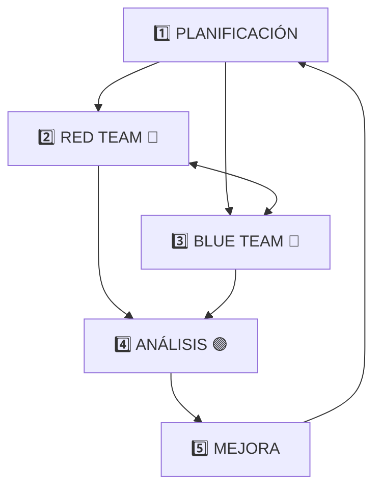

<div align="center">


# 🟣 Purple Team Windsurf

### Validación Continua de Controles de Seguridad

<br>

[](https://www.kali.org/)
[](https://attack.mitre.org/)
[](https://github.com/)
[](https://windsurf.ai/)
[](LICENSE)

<br>

[](attacks/)
[](detections/)
[](playbooks/)
[](https://github.com/redcanaryco/atomic-red-team)
[](https://github.com/mitre/caldera)
[](rules/sigma/)
[](rules/yara/)

---

### 🎯 **Validación Continua de Controles de Seguridad**

*Simula ataques reales • Valida detecciones • Cierra brechas de seguridad*

</div>

---

## 📋 Tabla de Contenidos

- [🎯 Objetivo](#-objetivo)
- [🔄 Metodología Purple Team](#-metodología-purple-team)
- [🗺️ MITRE ATT&CK Mapping](#️-mitre-attck-mapping)
- [🛠️ Herramientas](#️-herramientas)
- [📁 Estructura del Proyecto](#-estructura-del-proyecto)
- [🚀 Instalación](#-instalación)
- [💻 Uso con Windsurf AI](#-uso-con-windsurf-ai)
- [📊 Workflows](#-workflows)
- [🔥 Ejercicios Purple Team](#-ejercicios-purple-team)
- [📈 Reportes](#-reportes)

---

## 🎯 Objetivo

| 🔴 ATACAR | ➡️ | 🔍 DETECTAR | ➡️ | 📊 ANALIZAR | ➡️ | 🛡️ MEJORAR |
|:---------:|:--:|:-----------:|:--:|:-----------:|:--:|:----------:|
| Simular técnicas ATT&CK | | Validar controles | | Identificar brechas | | Implementar mejoras |

**Purple Team** combina las capacidades ofensivas del **Red Team** con las defensivas del **Blue Team** para:

- ✅ **Validar** que los controles de seguridad funcionan correctamente
- ✅ **Identificar** brechas en la detección y respuesta
- ✅ **Mejorar** continuamente las defensas basándose en ataques reales
- ✅ **Documentar** técnicas, detecciones y recomendaciones
- ✅ **Automatizar** ejercicios de validación de seguridad

---

## 🔄 Metodología Purple Team



### Ciclo Purple Team

| Paso | Equipo | Actividades |
|:----:|:------:|-------------|
| **1. Planificar** | 🟣 Purple | Seleccionar técnica ATT&CK, definir objetivos |
| **2. Atacar** | 🔴 Red | Ejecutar simulación con Atomic/Caldera |
| **3. Detectar** | 🔵 Blue | Monitorear SIEM, EDR, Sigma rules |
| **4. Analizar** | 🟣 Purple | Comparar ataque vs detección, medir MTTD |
| **5. Mejorar** | 🔵 Blue | Crear reglas, actualizar playbooks |
| **6. Validar** | 🔴 Red | Re-ejecutar y confirmar detección |

### Fases del Ejercicio

| Fase | Descripción | Responsable | Entregable |
|------|-------------|-------------|------------|
| **Planificación** | Selección de técnicas y preparación | Purple Team | Plan de ejercicio |
| **Ejecución** | Simulación de ataques | Red Team | Logs de ataque |
| **Detección** | Monitoreo y alertas | Blue Team | Alertas generadas |
| **Análisis** | Comparación y brechas | Purple Team | Gap Analysis |
| **Mejora** | Implementación de fixes | Blue Team | Nuevas reglas |
| **Validación** | Re-ejecución del ataque | Red Team | Confirmación |

---

## 🗺️ MITRE ATT&CK Mapping

<div align="center">

[](https://attack.mitre.org/)

</div>

| Reconnaissance | Initial Access | Execution | Persistence | Priv Escalation |
|:--------------:|:--------------:|:---------:|:-----------:|:---------------:|
| T1595 Scanning | T1566 Phishing | T1059 Scripts | T1547 Boot/Logon | T1548 Abuse |
| T1592 Gather | T1190 Exploit | T1204 User Exec | T1053 Scheduled | T1134 Token |

| Defense Evasion | Credential Access | Discovery | Lateral Movement | Exfiltration |
|:---------------:|:-----------------:|:---------:|:----------------:|:------------:|
| T1070 Clear Logs | T1003 Dump Creds | T1082 System | T1021 Remote Svc | T1048 Alt Protocol |
| T1055 Injection | T1110 Brute Force | T1083 Files | T1570 Tool Transfer | T1567 Web Service |

### Técnicas Prioritarias para Validación

| Táctica | Técnica | ID | Herramienta de Simulación | Detección Esperada |
|---------|---------|----|--------------------------|--------------------|
| **Initial Access** | Phishing | T1566 | Gophish, King Phisher | Email Gateway, EDR |
| **Execution** | PowerShell | T1059.001 | Atomic Red Team | AMSI, Script Block Logging |
| **Persistence** | Registry Run Keys | T1547.001 | Atomic Red Team | Sysmon Event 13 |
| **Privilege Escalation** | Token Manipulation | T1134 | Caldera | EDR, Sysmon Event 10 |
| **Defense Evasion** | Process Injection | T1055 | Infection Monkey | EDR, Memory Analysis |
| **Credential Access** | LSASS Dump | T1003.001 | Mimikatz, Atomic | Sysmon Event 10, EDR |
| **Discovery** | System Info | T1082 | Native Commands | Command Line Logging |
| **Lateral Movement** | PsExec | T1021.002 | Impacket | Network, Event 4648 |
| **Collection** | Keylogging | T1056.001 | Custom Scripts | EDR, API Monitoring |
| **Exfiltration** | HTTP Exfil | T1048 | Custom Scripts | DLP, Network Monitor |

---

## 🛠️ Herramientas

### 🔴 Herramientas Ofensivas (Red Team)

<table>
<tr>
<td width="50%">

#### Simulación de Ataques
| Herramienta | Descripción |
|-------------|-------------|
| **Atomic Red Team** | Tests atómicos por técnica ATT&CK |
| **MITRE Caldera** | Plataforma de adversary emulation |
| **Infection Monkey** | Breach and attack simulation |
| **Stratus Red Team** | Cloud attack simulation |
| **Cobalt Strike** | Adversary simulation platform |
| **Metasploit** | Penetration testing framework |

</td>
<td width="50%">

#### Herramientas Kali Linux
| Herramienta | Uso |
|-------------|-----|
| **Nmap** | Network scanning |
| **Burp Suite** | Web app testing |
| **Impacket** | Network protocols |
| **Mimikatz** | Credential extraction |
| **BloodHound** | AD attack paths |
| **CrackMapExec** | Post-exploitation |

</td>
</tr>
</table>

### 🔵 Herramientas Defensivas (Blue Team)

<table>
<tr>
<td width="50%">

#### Detección y Monitoreo
| Herramienta | Descripción |
|-------------|-------------|
| **Sigma** | Generic detection rules |
| **YARA** | Malware identification |
| **Sysmon** | System monitoring |
| **Velociraptor** | Endpoint visibility |
| **Wazuh** | SIEM/XDR platform |
| **Elastic Security** | SIEM solution |

</td>
<td width="50%">

#### Análisis y Respuesta
| Herramienta | Uso |
|-------------|-----|
| **Volatility** | Memory forensics |
| **RITA** | Network traffic analysis |
| **Zeek** | Network monitoring |
| **TheHive** | Incident response |
| **MISP** | Threat intelligence |
| **OpenCTI** | Threat intelligence |

</td>
</tr>
</table>

### 🟣 Herramientas Purple Team

| Herramienta | Descripción | Uso Principal |
|-------------|-------------|---------------|
| **DetectionLab** | Laboratorio de detección | Ambiente de pruebas |
| **Splunk Attack Range** | Simulación + detección | Ejercicios integrados |
| **Vectr** | Purple team tracking | Documentación |
| **DeTTECT** | ATT&CK scoring | Gap analysis |
| **ATT&CK Navigator** | Visualización | Mapeo de cobertura |

---

## 📁 Estructura del Proyecto

```
PurpleTeam-Windsurf/
│
├── 📄 README.md                    # Este archivo
├── 📄 memoria.md                   # Documentación de construcción
├── 🔧 install.sh                   # Script de instalación
├── ⚙️ .windsurfrules               # Reglas para Windsurf AI
│
├── 🔴 attacks/                     # Simulaciones de ataque
│   ├── atomic/                     # Tests Atomic Red Team
│   ├── caldera/                    # Operaciones Caldera
│   ├── custom/                     # Ataques personalizados
│   └── scenarios/                  # Escenarios complejos
│
├── 🔵 detections/                  # Reglas de detección
│   ├── sigma/                      # Reglas Sigma
│   ├── yara/                       # Reglas YARA
│   ├── elastic/                    # Queries Elastic
│   └── splunk/                     # Queries Splunk
│
├── 🟣 gaps/                        # Brechas encontradas
│   ├── analysis/                   # Análisis de gaps
│   ├── recommendations/            # Recomendaciones
│   └── tracking/                   # Seguimiento
│
├── 🗺️ mitre/                       # Mapeo ATT&CK
│   ├── coverage/                   # Cobertura actual
│   ├── navigator/                  # Archivos Navigator
│   └── techniques/                 # Técnicas documentadas
│
├── 📚 playbooks/                   # Playbooks de ejercicios
│   ├── red/                        # Playbooks ofensivos
│   ├── blue/                       # Playbooks defensivos
│   └── purple/                     # Ejercicios integrados
│
├── 📊 reports/                     # Reportes Purple
│   ├── exercises/                  # Reportes de ejercicios
│   ├── gaps/                       # Reportes de brechas
│   └── metrics/                    # Métricas y KPIs
│
├── 📜 rules/                       # Reglas de detección
│   ├── sigma/                      # Sigma rules
│   └── yara/                       # YARA rules
│
├── 🎭 simulations/                 # Escenarios de simulación
│   ├── apt/                        # Simulaciones APT
│   ├── ransomware/                 # Simulaciones ransomware
│   └── insider/                    # Amenazas internas
│
├── 🔧 tools/                       # Scripts y herramientas
│   └── custom-scripts/
│       ├── attack_simulate.py      # Simular técnicas ATT&CK
│       ├── detection_validate.sh   # Validar detecciones
│       ├── gap_analyzer.py         # Analizar brechas
│       ├── mitre_mapper.py         # Mapear a MITRE ATT&CK
│       └── purple_report.py        # Generar reportes
│
├── 📂 skills/                      # Skills de Windsurf
│   └── *.md                        # Definiciones de skills
│
├── 📂 .windsurf/                   # Configuración Windsurf
│   └── workflows/                  # Workflows disponibles
│       ├── simulate.md
│       ├── validate.md
│       ├── gap-analysis.md
│       └── purple-exercise.md
│
├── 📂 logs/                        # Logs de ejercicios
├── 📂 evidence/                    # Evidencia recolectada
└── 📂 templates/                   # Plantillas
```

---

## 🚀 Instalación

### Requisitos Previos

- **Kali Linux** 2023.x o superior
- **Python** 3.10+
- **Docker** y Docker Compose
- **Git**
- Conexión a Internet

### Instalación Rápida

```bash
# Clonar el repositorio
git clone https://github.com/tu-usuario/PurpleTeam-Windsurf.git
cd PurpleTeam-Windsurf

# Ejecutar instalador
chmod +x install.sh
sudo ./install.sh

# Activar entorno virtual
source venv/bin/activate
```

### Instalación Manual

```bash
# Instalar Atomic Red Team
IEX (IWR 'https://raw.githubusercontent.com/redcanaryco/invoke-atomicredteam/master/install-atomicredteam.ps1' -UseBasicParsing)

# Instalar Caldera
git clone https://github.com/mitre/caldera.git --recursive
cd caldera && pip install -r requirements.txt

# Instalar Sigma
pip install sigma-cli

# Instalar herramientas adicionales
sudo apt install -y sysmon volatility3 yara
```

---

## 💻 Uso con Windsurf AI

### Comandos Rápidos

```
/simulate T1059.001     # Simular PowerShell execution
/validate T1059.001     # Validar detección de la técnica
/gap-analysis           # Analizar brechas de detección
/purple-exercise        # Ejecutar ejercicio completo
```

### Ejemplos de Uso

#### Simular una Técnica ATT&CK
```
Usuario: /simulate T1003.001
Windsurf: Ejecutando simulación de LSASS Memory Dump...
         - Herramienta: Atomic Red Team
         - Técnica: T1003.001 - OS Credential Dumping: LSASS Memory
         - Comando: Invoke-AtomicTest T1003.001
         ✅ Simulación completada. Verificando detecciones...
```

#### Validar Detecciones
```
Usuario: /validate T1003.001
Windsurf: Validando detecciones para T1003.001...
         - Sigma Rule: proc_access_win_lsass_memdump.yml ✅
         - Sysmon Event 10: Detectado ✅
         - EDR Alert: Pendiente ⏳
         📊 Cobertura: 66% - Se recomienda mejorar
```

---

## 📊 Workflows

### `/simulate` - Simular Técnica ATT&CK

Ejecuta una simulación de ataque basada en MITRE ATT&CK.

```yaml
Parámetros:
  - technique_id: ID de la técnica (ej: T1059.001)
  - tool: Herramienta a usar (atomic, caldera, custom)
  - target: Sistema objetivo (local, remote)
  
Salida:
  - Logs de ejecución
  - Artefactos generados
  - Timestamp de ejecución
```

### `/validate` - Validar Detección

Verifica si los controles detectaron el ataque.

```yaml
Parámetros:
  - technique_id: ID de la técnica
  - timeframe: Ventana de tiempo a revisar
  - sources: Fuentes de detección (siem, edr, logs)
  
Salida:
  - Estado de detección por fuente
  - Alertas generadas
  - Tiempo de detección
```

### `/gap-analysis` - Analizar Brechas

Identifica brechas en la cobertura de detección.

```yaml
Parámetros:
  - scope: Alcance (technique, tactic, all)
  - priority: Prioridad de técnicas
  
Salida:
  - Lista de técnicas sin cobertura
  - Recomendaciones de mejora
  - Priorización de acciones
```

### `/purple-exercise` - Ejercicio Completo

Ejecuta un ciclo completo de Purple Team.

```yaml
Parámetros:
  - scenario: Escenario a ejecutar
  - techniques: Lista de técnicas
  - report: Generar reporte (true/false)
  
Salida:
  - Reporte completo del ejercicio
  - Métricas de detección
  - Plan de mejora
```

---

## 🔥 Ejercicios Purple Team

### Ejercicio 1: Credential Access

| Campo | Detalle |
|-------|---------|
| **Técnicas** | T1003.001, T1003.002, T1003.003 |
| **Objetivo** | Validar detección de dump de credenciales |
| **Duración** | 2 horas |

**Pasos:**
1. Ejecutar `Mimikatz sekurlsa::logonpasswords`
2. Verificar alerta en EDR
3. Verificar Sysmon Event 10
4. Documentar tiempo de detección
5. Identificar gaps y mejorar

### Ejercicio 2: Lateral Movement

| Campo | Detalle |
|-------|---------|
| **Técnicas** | T1021.002, T1021.001, T1570 |
| **Objetivo** | Validar detección de movimiento lateral |
| **Duración** | 3 horas |

**Pasos:**
1. Ejecutar PsExec hacia sistema remoto
2. Usar WMI para ejecución remota
3. Verificar logs de autenticación
4. Verificar detecciones de red
5. Documentar y mejorar

---

## 📈 Reportes

### Métricas Clave

| Métrica | Descripción | Objetivo |
|---------|-------------|----------|
| **MTTD** | Mean Time to Detect | < 15 min |
| **MTTR** | Mean Time to Respond | < 1 hora |
| **Cobertura ATT&CK** | % de técnicas detectables | > 70% |
| **False Positive Rate** | Tasa de falsos positivos | < 5% |
| **Detection Accuracy** | Precisión de detección | > 95% |

### Formato de Reporte

```markdown
# Purple Team Exercise Report

## Executive Summary
- Fecha: YYYY-MM-DD
- Técnicas probadas: X
- Detectadas: Y
- Brechas: Z

## Resultados por Técnica
| Técnica | Estado | Tiempo Detección | Recomendación |
|---------|--------|------------------|---------------|
| T1003.001 | ✅ | 2 min | Mantener |
| T1055.001 | ❌ | N/A | Crear regla |

## Recomendaciones
1. Implementar regla Sigma para T1055
2. Mejorar logging de PowerShell
3. Actualizar playbook de respuesta

## Próximos Pasos
- [ ] Implementar mejoras
- [ ] Re-ejecutar ejercicio
- [ ] Validar correcciones
```

---

## 🤝 Contribución

1. Fork el repositorio
2. Crea una rama: `git checkout -b feature/nueva-feature`
3. Commit cambios: `git commit -m 'Add nueva feature'`
4. Push a la rama: `git push origin feature/nueva-feature`
5. Abre un Pull Request

---

## 📜 Licencia

Este proyecto está bajo la Licencia MIT. Ver el archivo [LICENSE](LICENSE) para más detalles.

---

<div align="center">

### 🔴 + 🔵 = 🟣

> *"La mejor defensa es entender cómo piensa el atacante"*

**Hecho con 💜 para la comunidad de seguridad**

[](https://github.com/MartinCrespoC/PurpleTeam---Windsurf)

</div>
