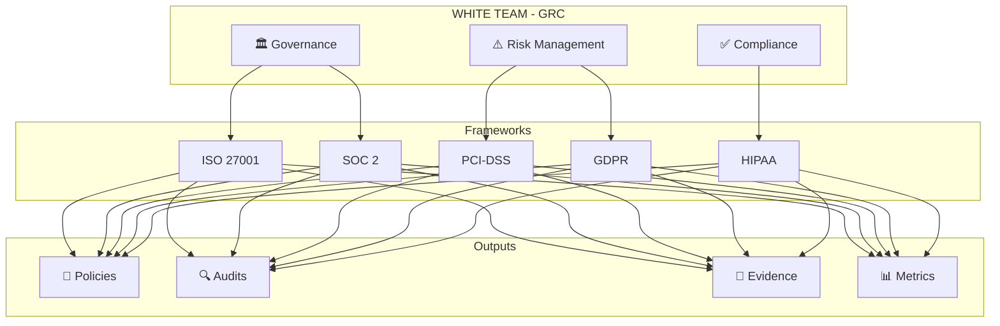
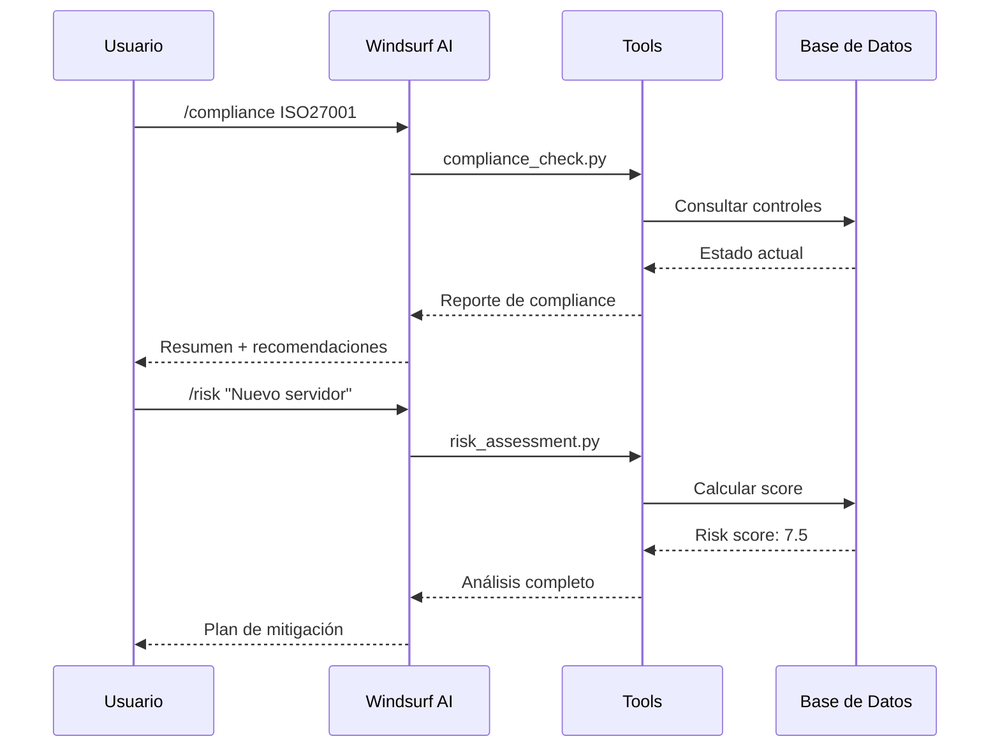

<p align="center">
  
</p>

<h1 align="center">
  ⚪ WHITE TEAM - GRC COMMAND CENTER
</h1>

<p align="center">
  <strong>Governance • Risk • Compliance</strong>
</p>

<p align="center">
  
  
  
  
  
  
</p>

<p align="center">
  
  
  
</p>

---

<p align="center">
  <em>"La seguridad no es un producto, es un proceso. El compliance no es un destino, es un viaje."</em>
</p>

---

## 📋 Tabla de Contenidos

- [🎯 Visión General](#-visión-general)
- [🏗️ Arquitectura](#️-arquitectura)
- [📚 Frameworks Soportados](#-frameworks-soportados)
- [⚡ Inicio Rápido](#-inicio-rápido)
- [🔧 Herramientas](#-herramientas)
- [📊 Gestión de Riesgos](#-gestión-de-riesgos)
- [🔍 Auditoría Interna](#-auditoría-interna)
- [📜 Políticas y Procedimientos](#-políticas-y-procedimientos)
- [🤖 Integración con Windsurf AI](#-integración-con-windsurf-ai)
- [📈 Métricas y KPIs](#-métricas-y-kpis)
- [🚀 Workflows](#-workflows)
- [📁 Estructura del Proyecto](#-estructura-del-proyecto)
- [🤝 Contribución](#-contribución)

---

## 🎯 Visión General

```
╔══════════════════════════════════════════════════════════════════════════════╗
║                                                                              ║
║   ██╗    ██╗██╗  ██╗██╗████████╗███████╗    ████████╗███████╗ █████╗ ███╗   ███╗   ║
║   ██║    ██║██║  ██║██║╚══██╔══╝██╔════╝    ╚══██╔══╝██╔════╝██╔══██╗████╗ ████║   ║
║   ██║ █╗ ██║███████║██║   ██║   █████╗         ██║   █████╗  ███████║██╔████╔██║   ║
║   ██║███╗██║██╔══██║██║   ██║   ██╔══╝         ██║   ██╔══╝  ██╔══██║██║╚██╔╝██║   ║
║   ╚███╔███╔╝██║  ██║██║   ██║   ███████╗       ██║   ███████╗██║  ██║██║ ╚═╝ ██║   ║
║    ╚══╝╚══╝ ╚═╝  ╚═╝╚═╝   ╚═╝   ╚══════╝       ╚═╝   ╚══════╝╚═╝  ╚═╝╚═╝     ╚═╝   ║
║                                                                              ║
║                    G O V E R N A N C E  •  R I S K  •  C O M P L I A N C E   ║
║                                                                              ║
╚══════════════════════════════════════════════════════════════════════════════╝
```

**WHITE TEAM GRC** es el centro de comando para la gestión integral de:

| Componente | Descripción | Objetivo |
|------------|-------------|----------|
| 🏛️ **Governance** | Marco de gobierno corporativo | Alineación estratégica |
| ⚠️ **Risk** | Gestión de riesgos empresariales | Mitigación proactiva |
| ✅ **Compliance** | Cumplimiento regulatorio | Adherencia normativa |

### 🎨 Filosofía del White Team



---

## 🏗️ Arquitectura

```
┌─────────────────────────────────────────────────────────────────────────────┐
│                           WHITE TEAM GRC ARCHITECTURE                        │
├─────────────────────────────────────────────────────────────────────────────┤
│                                                                             │
│  ┌─────────────────────────────────────────────────────────────────────┐   │
│  │                        🤖 WINDSURF AI LAYER                          │   │
│  │  ┌─────────────┐  ┌─────────────┐  ┌─────────────┐  ┌─────────────┐ │   │
│  │  │   Skills    │  │  Workflows  │  │   Rules     │  │   Memory    │ │   │
│  │  └─────────────┘  └─────────────┘  └─────────────┘  └─────────────┘ │   │
│  └─────────────────────────────────────────────────────────────────────┘   │
│                                    │                                        │
│  ┌─────────────────────────────────▼───────────────────────────────────┐   │
│  │                        📊 GRC MANAGEMENT LAYER                       │   │
│  │                                                                      │   │
│  │   ┌──────────────┐    ┌──────────────┐    ┌──────────────┐          │   │
│  │   │  GOVERNANCE  │    │     RISK     │    │  COMPLIANCE  │          │   │
│  │   │              │    │              │    │              │          │   │
│  │   │ • Policies   │    │ • Assessment │    │ • Monitoring │          │   │
│  │   │ • Standards  │    │ • Treatment  │    │ • Evidence   │          │   │
│  │   │ • Procedures │    │ • Monitoring │    │ • Reporting  │          │   │
│  │   └──────────────┘    └──────────────┘    └──────────────┘          │   │
│  │                                                                      │   │
│  └─────────────────────────────────────────────────────────────────────┘   │
│                                    │                                        │
│  ┌─────────────────────────────────▼───────────────────────────────────┐   │
│  │                        🔧 TOOLS & AUTOMATION                         │   │
│  │                                                                      │   │
│  │  ┌────────────┐ ┌────────────┐ ┌────────────┐ ┌────────────┐        │   │
│  │  │ Compliance │ │    Risk    │ │   Policy   │ │   Audit    │        │   │
│  │  │   Check    │ │ Assessment │ │ Generator  │ │  Checklist │        │   │
│  │  └────────────┘ └────────────┘ └────────────┘ └────────────┘        │   │
│  │                                                                      │   │
│  │  ┌────────────┐ ┌────────────┐ ┌────────────┐ ┌────────────┐        │   │
│  │  │    Gap     │ │   Report   │ │  Evidence  │ │  Control   │        │   │
│  │  │  Analysis  │ │ Generator  │ │  Collector │ │   Mapper   │        │   │
│  │  └────────────┘ └────────────┘ └────────────┘ └────────────┘        │   │
│  │                                                                      │   │
│  └─────────────────────────────────────────────────────────────────────┘   │
│                                    │                                        │
│  ┌─────────────────────────────────▼───────────────────────────────────┐   │
│  │                        📚 FRAMEWORK LAYER                            │   │
│  │                                                                      │   │
│  │  ┌─────────┐ ┌─────────┐ ┌─────────┐ ┌─────────┐ ┌─────────┐        │   │
│  │  │ISO 27001│ │  SOC 2  │ │ PCI-DSS │ │  GDPR   │ │  HIPAA  │        │   │
│  │  └─────────┘ └─────────┘ └─────────┘ └─────────┘ └─────────┘        │   │
│  │                                                                      │   │
│  │  ┌─────────┐ ┌─────────┐ ┌─────────┐ ┌─────────┐ ┌─────────┐        │   │
│  │  │NIST CSF │ │  COBIT  │ │   CIS   │ │  CMMC   │ │  ITIL   │        │   │
│  │  └─────────┘ └─────────┘ └─────────┘ └─────────┘ └─────────┘        │   │
│  │                                                                      │   │
│  └─────────────────────────────────────────────────────────────────────┘   │
│                                                                             │
└─────────────────────────────────────────────────────────────────────────────┘
```

---

## 📚 Frameworks Soportados

### 🔵 ISO 27001:2022 - Sistema de Gestión de Seguridad de la Información

```yaml
Framework: ISO/IEC 27001:2022
Tipo: Certificable
Alcance: Global
Controles: 93 controles en 4 categorías

Categorías:
  - Organizacionales (37 controles)
  - Personas (8 controles)
  - Físicos (14 controles)
  - Tecnológicos (34 controles)

Cláusulas:
  4: Contexto de la organización
  5: Liderazgo
  6: Planificación
  7: Soporte
  8: Operación
  9: Evaluación del desempeño
  10: Mejora
```

### 🟢 SOC 2 Type II - Trust Services Criteria

```yaml
Framework: SOC 2 Type II
Tipo: Atestación
Alcance: Servicios en la nube
Período: 6-12 meses de evaluación

Trust Services Criteria:
  CC: Common Criteria (Security)
  A: Availability
  PI: Processing Integrity
  C: Confidentiality
  P: Privacy

Puntos de Enfoque:
  - Control Environment
  - Communication & Information
  - Risk Assessment
  - Monitoring Activities
  - Control Activities
```

### 🟠 PCI-DSS v4.0 - Payment Card Industry

```yaml
Framework: PCI-DSS v4.0
Tipo: Mandatorio (industria de pagos)
Alcance: Datos de tarjetas de pago
Requisitos: 12 requisitos principales

Requisitos:
  1: Instalar y mantener controles de seguridad de red
  2: Aplicar configuraciones seguras
  3: Proteger datos de cuenta almacenados
  4: Proteger datos de tarjeta en tránsito
  5: Proteger contra malware
  6: Desarrollar software seguro
  7: Restringir acceso por necesidad de negocio
  8: Identificar usuarios y autenticar acceso
  9: Restringir acceso físico
  10: Registrar y monitorear accesos
  11: Probar seguridad regularmente
  12: Soportar seguridad con políticas
```

### 🟣 GDPR - Reglamento General de Protección de Datos

```yaml
Framework: GDPR (EU 2016/679)
Tipo: Regulación legal
Alcance: Datos personales de ciudadanos UE
Artículos: 99 artículos

Principios Clave:
  - Licitud, lealtad y transparencia
  - Limitación de la finalidad
  - Minimización de datos
  - Exactitud
  - Limitación del plazo de conservación
  - Integridad y confidencialidad
  - Responsabilidad proactiva

Derechos del Interesado:
  - Acceso
  - Rectificación
  - Supresión (olvido)
  - Portabilidad
  - Oposición
  - Limitación del tratamiento
```

### 🔴 HIPAA - Health Insurance Portability and Accountability Act

```yaml
Framework: HIPAA
Tipo: Regulación legal (EE.UU.)
Alcance: Información de salud protegida (PHI)

Reglas:
  Privacy Rule: Protección de PHI
  Security Rule: Salvaguardas técnicas
  Breach Notification: Notificación de brechas
  Enforcement Rule: Sanciones

Salvaguardas:
  Administrativas:
    - Análisis de riesgos
    - Gestión de riesgos
    - Políticas de sanciones
    - Revisión de actividad
    
  Físicas:
    - Control de acceso a instalaciones
    - Uso de estaciones de trabajo
    - Seguridad de dispositivos
    
  Técnicas:
    - Control de acceso
    - Controles de auditoría
    - Integridad
    - Autenticación
    - Transmisión segura
```

### 🔷 NIST Cybersecurity Framework 2.0

```yaml
Framework: NIST CSF 2.0
Tipo: Voluntario (recomendado)
Alcance: Infraestructura crítica

Funciones:
  GOVERN: Establecer estrategia de ciberseguridad
  IDENTIFY: Comprender el contexto de ciberseguridad
  PROTECT: Implementar salvaguardas
  DETECT: Identificar incidentes
  RESPOND: Responder a incidentes
  RECOVER: Restaurar capacidades

Tiers:
  1: Partial
  2: Risk Informed
  3: Repeatable
  4: Adaptive
```

---

## ⚡ Inicio Rápido

### Prerrequisitos

```bash
# Sistema operativo
Linux (Ubuntu 20.04+, Debian 11+, RHEL 8+)
macOS 12+
Windows 10+ (con WSL2)

# Software requerido
Python 3.11+
Git 2.30+
Docker 20.10+ (opcional)
Node.js 18+ (opcional, para reportes)
```

### Instalación

```bash
# 1. Clonar el repositorio
git clone https://github.com/your-org/whiteteam-grc.git
cd whiteteam-grc

# 2. Ejecutar instalador
chmod +x install.sh
./install.sh

# 3. Activar entorno virtual
source venv/bin/activate

# 4. Verificar instalación
python tools/custom-scripts/compliance_check.py --version
```

### Configuración Inicial

```bash
# Configurar organización
python tools/custom-scripts/setup_organization.py

# Seleccionar frameworks
python tools/custom-scripts/framework_selector.py

# Importar controles existentes (opcional)
python tools/custom-scripts/import_controls.py --source existing_controls.csv
```

---

## 🔧 Herramientas

### 📊 Suite de Scripts GRC

| Script | Descripción | Uso |
|--------|-------------|-----|
| `compliance_check.py` | Verificar estado de compliance | `python compliance_check.py --framework ISO27001` |
| `risk_assessment.py` | Evaluar y calcular riesgos | `python risk_assessment.py --asset "Web Server"` |
| `policy_generator.py` | Generar políticas automáticamente | `python policy_generator.py --type "Access Control"` |
| `audit_checklist.py` | Crear checklists de auditoría | `python audit_checklist.py --framework SOC2` |
| `gap_analysis.py` | Análisis de brechas de compliance | `python gap_analysis.py --target 100` |
| `report_generator.py` | Generar reportes ejecutivos | `python report_generator.py --format pdf` |
| `evidence_collector.py` | Recopilar evidencia automáticamente | `python evidence_collector.py --control A.5.1` |
| `control_mapper.py` | Mapear controles entre frameworks | `python control_mapper.py --from ISO27001 --to SOC2` |

### 🔄 Flujo de Trabajo Típico



---

## 📊 Gestión de Riesgos

### Metodología de Evaluación

```
┌─────────────────────────────────────────────────────────────────────────────┐
│                         RISK ASSESSMENT MATRIX                               │
├─────────────────────────────────────────────────────────────────────────────┤
│                                                                             │
│  PROBABILIDAD                                                               │
│       │                                                                     │
│   5   │  5    10    15    20    25                                         │
│  Muy  │  ┌─────┬─────┬─────┬─────┬─────┐                                   │
│  Alta │  │ MED │ MED │HIGH │CRIT │CRIT │                                   │
│       │  └─────┴─────┴─────┴─────┴─────┘                                   │
│   4   │  4     8    12    16    20                                         │
│  Alta │  ┌─────┬─────┬─────┬─────┬─────┐                                   │
│       │  │ LOW │ MED │ MED │HIGH │CRIT │                                   │
│       │  └─────┴─────┴─────┴─────┴─────┘                                   │
│   3   │  3     6     9    12    15                                         │
│ Media │  ┌─────┬─────┬─────┬─────┬─────┐                                   │
│       │  │ LOW │ LOW │ MED │ MED │HIGH │                                   │
│       │  └─────┴─────┴─────┴─────┴─────┘                                   │
│   2   │  2     4     6     8    10                                         │
│  Baja │  ┌─────┬─────┬─────┬─────┬─────┐                                   │
│       │  │VLOW │ LOW │ LOW │ MED │ MED │                                   │
│       │  └─────┴─────┴─────┴─────┴─────┘                                   │
│   1   │  1     2     3     4     5                                         │
│  Muy  │  ┌─────┬─────┬─────┬─────┬─────┐                                   │
│  Baja │  │VLOW │VLOW │ LOW │ LOW │ MED │                                   │
│       │  └─────┴─────┴─────┴─────┴─────┘                                   │
│       └────────────────────────────────────────────────────────────────    │
│              1        2        3        4        5                          │
│            Muy      Bajo    Medio     Alto    Muy                          │
│            Bajo                               Alto                          │
│                           IMPACTO                                           │
│                                                                             │
│  LEYENDA:                                                                   │
│  ┌──────┐ VLOW (1-2)  : Riesgo Muy Bajo - Aceptar                          │
│  │ VLOW │                                                                   │
│  └──────┘                                                                   │
│  ┌──────┐ LOW (3-5)   : Riesgo Bajo - Monitorear                           │
│  │ LOW  │                                                                   │
│  └──────┘                                                                   │
│  ┌──────┐ MED (6-10)  : Riesgo Medio - Mitigar                             │
│  │ MED  │                                                                   │
│  └──────┘                                                                   │
│  ┌──────┐ HIGH (12-16): Riesgo Alto - Priorizar                            │
│  │ HIGH │                                                                   │
│  └──────┘                                                                   │
│  ┌──────┐ CRIT (20-25): Riesgo Crítico - Acción Inmediata                  │
│  │ CRIT │                                                                   │
│  └──────┘                                                                   │
│                                                                             │
└─────────────────────────────────────────────────────────────────────────────┘
```

### Fórmula de Cálculo de Riesgo

```python
# Riesgo Inherente
Riesgo_Inherente = Probabilidad × Impacto

# Efectividad del Control (0-100%)
Efectividad_Control = (Controles_Implementados / Controles_Requeridos) × 100

# Riesgo Residual
Riesgo_Residual = Riesgo_Inherente × (1 - Efectividad_Control/100)

# Risk Score Final (normalizado 0-10)
Risk_Score = (Riesgo_Residual / 25) × 10
```

### Categorías de Riesgo

| Categoría | Descripción | Ejemplos |
|-----------|-------------|----------|
| **Estratégico** | Riesgos que afectan objetivos de negocio | Competencia, mercado, reputación |
| **Operacional** | Riesgos en procesos diarios | Fallas de sistema, errores humanos |
| **Financiero** | Riesgos económicos | Fraude, pérdidas, multas |
| **Compliance** | Incumplimiento regulatorio | Violaciones GDPR, PCI-DSS |
| **Tecnológico** | Riesgos de TI | Ciberataques, vulnerabilidades |
| **Terceros** | Riesgos de proveedores | Supply chain, outsourcing |

---

## 🔍 Auditoría Interna

### Ciclo de Auditoría

```
┌─────────────────────────────────────────────────────────────────────────────┐
│                           CICLO DE AUDITORÍA                                 │
├─────────────────────────────────────────────────────────────────────────────┤
│                                                                             │
│                          ┌─────────────┐                                    │
│                          │ PLANIFICAR  │                                    │
│                          │             │                                    │
│                          │ • Alcance   │                                    │
│                          │ • Objetivos │                                    │
│                          │ • Recursos  │                                    │
│                          └──────┬──────┘                                    │
│                                 │                                           │
│                                 ▼                                           │
│     ┌─────────────┐      ┌─────────────┐      ┌─────────────┐              │
│     │   MEJORAR   │      │  EJECUTAR   │      │  REPORTAR   │              │
│     │             │◄─────│             │─────►│             │              │
│     │ • Acciones  │      │ • Entrevistas│     │ • Hallazgos │              │
│     │ • Seguimiento│     │ • Evidencia │      │ • Riesgos   │              │
│     │ • Verificar │      │ • Testing   │      │ • Recomen.  │              │
│     └──────┬──────┘      └─────────────┘      └──────┬──────┘              │
│            │                                         │                      │
│            │              ┌─────────────┐            │                      │
│            └─────────────►│  COMUNICAR  │◄───────────┘                      │
│                          │             │                                    │
│                          │ • Stakeholders│                                  │
│                          │ • Dirección │                                    │
│                          │ • Equipos   │                                    │
│                          └─────────────┘                                    │
│                                                                             │
└─────────────────────────────────────────────────────────────────────────────┘
```

### Tipos de Auditoría

| Tipo | Frecuencia | Objetivo |
|------|------------|----------|
| **Compliance** | Anual | Verificar cumplimiento normativo |
| **Operacional** | Semestral | Evaluar eficiencia de procesos |
| **Técnica** | Trimestral | Revisar controles técnicos |
| **Sorpresa** | Ad-hoc | Verificar estado real |
| **Seguimiento** | Mensual | Validar remediaciones |

### Clasificación de Hallazgos

```yaml
Crítico:
  Descripción: "Incumplimiento grave con impacto inmediato"
  SLA_Remediación: "7 días"
  Escalamiento: "C-Level inmediato"
  Color: "🔴"

Alto:
  Descripción: "Incumplimiento significativo"
  SLA_Remediación: "30 días"
  Escalamiento: "Director de área"
  Color: "🟠"

Medio:
  Descripción: "Desviación de mejores prácticas"
  SLA_Remediación: "60 días"
  Escalamiento: "Gerente"
  Color: "🟡"

Bajo:
  Descripción: "Oportunidad de mejora"
  SLA_Remediación: "90 días"
  Escalamiento: "Supervisor"
  Color: "🟢"

Observación:
  Descripción: "Nota informativa"
  SLA_Remediación: "N/A"
  Escalamiento: "N/A"
  Color: "🔵"
```

---

## 📜 Políticas y Procedimientos

### Jerarquía Documental

```
┌─────────────────────────────────────────────────────────────────────────────┐
│                         JERARQUÍA DOCUMENTAL                                 │
├─────────────────────────────────────────────────────────────────────────────┤
│                                                                             │
│                          ┌─────────────────┐                                │
│                          │    POLÍTICAS    │                                │
│                          │                 │                                │
│                          │  "QUÉ hacer"    │                                │
│                          │   Alto nivel    │                                │
│                          │   Aprobación:   │                                │
│                          │   Dirección     │                                │
│                          └────────┬────────┘                                │
│                                   │                                         │
│                    ┌──────────────┼──────────────┐                          │
│                    │              │              │                          │
│              ┌─────▼─────┐ ┌─────▼─────┐ ┌─────▼─────┐                      │
│              │ ESTÁNDARES│ │  NORMAS   │ │DIRECTRICES│                      │
│              │           │ │           │ │           │                      │
│              │"CÓMO medir"│ │"Requisitos"│ │"Guías"   │                      │
│              └─────┬─────┘ └─────┬─────┘ └─────┬─────┘                      │
│                    │             │             │                            │
│                    └──────────────┼──────────────┘                          │
│                                   │                                         │
│                          ┌────────▼────────┐                                │
│                          │  PROCEDIMIENTOS │                                │
│                          │                 │                                │
│                          │ "CÓMO hacerlo"  │                                │
│                          │  Paso a paso    │                                │
│                          │  Operativo      │                                │
│                          └────────┬────────┘                                │
│                                   │                                         │
│                    ┌──────────────┼──────────────┐                          │
│                    │              │              │                          │
│              ┌─────▼─────┐ ┌─────▼─────┐ ┌─────▼─────┐                      │
│              │ GUÍAS     │ │INSTRUCTIVOS│ │FORMULARIOS│                     │
│              │ TÉCNICAS  │ │ DE TRABAJO │ │ REGISTROS │                     │
│              └───────────┘ └───────────┘ └───────────┘                      │
│                                                                             │
└─────────────────────────────────────────────────────────────────────────────┘
```

### Políticas Incluidas

| Política | Código | Versión | Estado |
|----------|--------|---------|--------|
| Seguridad de la Información | POL-SEC-001 | 3.0 | ✅ Vigente |
| Control de Acceso | POL-ACC-001 | 2.5 | ✅ Vigente |
| Gestión de Activos | POL-AST-001 | 2.0 | ✅ Vigente |
| Clasificación de Información | POL-CLS-001 | 1.5 | ✅ Vigente |
| Uso Aceptable | POL-AUP-001 | 2.0 | ✅ Vigente |
| Gestión de Incidentes | POL-INC-001 | 2.0 | ✅ Vigente |
| Continuidad de Negocio | POL-BCP-001 | 1.5 | ✅ Vigente |
| Privacidad de Datos | POL-PRV-001 | 2.0 | ✅ Vigente |
| Gestión de Proveedores | POL-VND-001 | 1.0 | ✅ Vigente |
| Desarrollo Seguro | POL-DEV-001 | 1.5 | ✅ Vigente |

---

## 🤖 Integración con Windsurf AI

### Capacidades de IA

```yaml
Automatización:
  - Generación automática de políticas
  - Mapeo inteligente de controles
  - Análisis de brechas con recomendaciones
  - Creación de checklists de auditoría
  - Cálculo automático de riesgos

Asistencia:
  - Respuestas a consultas de compliance
  - Interpretación de requisitos normativos
  - Sugerencias de remediación
  - Priorización de hallazgos

Reportes:
  - Dashboards ejecutivos
  - Informes de estado
  - Métricas de KPIs
  - Tendencias y análisis
```

### Comandos de Windsurf

| Comando | Descripción |
|---------|-------------|
| `/audit` | Iniciar proceso de auditoría |
| `/risk` | Evaluar un riesgo específico |
| `/compliance` | Verificar estado de compliance |
| `/policy` | Generar una nueva política |
| `/gap` | Ejecutar análisis de brechas |
| `/control` | Mapear control a frameworks |
| `/evidence` | Recopilar evidencia |
| `/report` | Generar reporte |

---

## 📈 Métricas y KPIs

### Dashboard de GRC

```
┌─────────────────────────────────────────────────────────────────────────────┐
│                           GRC DASHBOARD                                      │
├─────────────────────────────────────────────────────────────────────────────┤
│                                                                             │
│  ┌─────────────────┐  ┌─────────────────┐  ┌─────────────────┐             │
│  │ COMPLIANCE SCORE│  │   RISK SCORE    │  │  AUDIT STATUS   │             │
│  │                 │  │                 │  │                 │             │
│  │      87%        │  │      3.2        │  │    12/15        │             │
│  │   ████████░░    │  │   ██░░░░░░░░    │  │   ████████░░    │             │
│  │                 │  │                 │  │                 │             │
│  │  ▲ +5% vs Q3    │  │  ▼ -0.8 vs Q3   │  │  80% Complete   │             │
│  └─────────────────┘  └─────────────────┘  └─────────────────┘             │
│                                                                             │
│  ┌─────────────────────────────────────────────────────────────────────┐   │
│  │                    COMPLIANCE BY FRAMEWORK                           │   │
│  │                                                                      │   │
│  │  ISO 27001  ████████████████████░░░░░░░░░░  78%                     │   │
│  │  SOC 2      ██████████████████████████░░░░  92%                     │   │
│  │  PCI-DSS    ████████████████████████░░░░░░  85%                     │   │
│  │  GDPR       ██████████████████████████████  95%                     │   │
│  │  HIPAA      ████████████████░░░░░░░░░░░░░░  65%                     │   │
│  │                                                                      │   │
│  └─────────────────────────────────────────────────────────────────────┘   │
│                                                                             │
│  ┌──────────────────────────┐  ┌──────────────────────────┐                │
│  │    OPEN FINDINGS         │  │    RISK DISTRIBUTION     │                │
│  │                          │  │                          │                │
│  │  🔴 Critical:  2         │  │  Critical ██░░  8%       │                │
│  │  🟠 High:      8         │  │  High     ████░ 18%      │                │
│  │  🟡 Medium:   15         │  │  Medium   ██████ 35%     │                │
│  │  🟢 Low:      23         │  │  Low      ████████ 39%   │                │
│  │                          │  │                          │                │
│  │  Total: 48 findings      │  │  Total: 127 risks        │                │
│  └──────────────────────────┘  └──────────────────────────┘                │
│                                                                             │
└─────────────────────────────────────────────────────────────────────────────┘
```

### KPIs Principales

| KPI | Objetivo | Actual | Tendencia |
|-----|----------|--------|-----------|
| Compliance Score Global | ≥90% | 87% | 📈 |
| Riesgos Críticos Abiertos | 0 | 2 | 📉 |
| Tiempo Medio de Remediación | ≤30 días | 25 días | 📈 |
| Controles Implementados | 100% | 94% | 📈 |
| Auditorías Completadas | 100% | 80% | ➡️ |
| Políticas Actualizadas | 100% | 100% | ✅ |
| Capacitación Completada | ≥95% | 92% | 📈 |
| Incidentes de Compliance | 0 | 1 | 📉 |

---

## 🚀 Workflows

### Workflows Disponibles

```bash
# Auditoría completa
/audit --framework ISO27001 --scope "IT Infrastructure"

# Evaluación de riesgo
/risk --asset "Production Database" --threat "Data Breach"

# Verificación de compliance
/compliance --check all --report pdf

# Generación de política
/policy --type "Remote Work" --based-on "ISO27001:A.6.2.2"

# Análisis de brechas
/gap --framework PCI-DSS --target 100

# Mapeo de controles
/control --map "A.5.1.1" --to SOC2,NIST

# Recopilación de evidencia
/evidence --control "A.9.2.1" --period Q4-2024

# Generación de reporte
/report --type executive --period monthly
```

---

## 📁 Estructura del Proyecto

```
WhiteTeam-Windsurf/
│
├── 📜 policies/                    # Políticas de seguridad
│   ├── security/                   # Políticas de seguridad
│   ├── privacy/                    # Políticas de privacidad
│   ├── access/                     # Políticas de acceso
│   └── templates/                  # Plantillas de políticas
│
├── 📋 procedures/                  # Procedimientos operativos
│   ├── incident-response/          # Respuesta a incidentes
│   ├── change-management/          # Gestión de cambios
│   ├── access-management/          # Gestión de accesos
│   └── backup-recovery/            # Backup y recuperación
│
├── 🔍 audits/                      # Auditorías
│   ├── internal/                   # Auditorías internas
│   ├── external/                   # Auditorías externas
│   ├── checklists/                 # Checklists
│   └── reports/                    # Reportes de auditoría
│
├── ⚠️ risks/                       # Gestión de riesgos
│   ├── assessments/                # Evaluaciones
│   ├── register/                   # Registro de riesgos
│   ├── treatments/                 # Planes de tratamiento
│   └── monitoring/                 # Monitoreo continuo
│
├── ✅ compliance/                  # Evidencia de compliance
│   ├── iso27001/                   # Evidencia ISO 27001
│   ├── soc2/                       # Evidencia SOC 2
│   ├── pci-dss/                    # Evidencia PCI-DSS
│   ├── gdpr/                       # Evidencia GDPR
│   └── hipaa/                      # Evidencia HIPAA
│
├── 📚 frameworks/                  # Frameworks de referencia
│   ├── iso27001/                   # ISO 27001:2022
│   ├── soc2/                       # SOC 2 TSC
│   ├── pci-dss/                    # PCI-DSS v4.0
│   ├── gdpr/                       # GDPR
│   ├── hipaa/                      # HIPAA
│   └── nist-csf/                   # NIST CSF 2.0
│
├── 🛡️ controls/                    # Controles implementados
│   ├── technical/                  # Controles técnicos
│   ├── administrative/             # Controles administrativos
│   ├── physical/                   # Controles físicos
│   └── mappings/                   # Mapeos entre frameworks
│
├── 🔧 tools/                       # Herramientas y scripts
│   └── custom-scripts/             # Scripts personalizados
│       ├── compliance_check.py
│       ├── risk_assessment.py
│       ├── policy_generator.py
│       ├── audit_checklist.py
│       ├── gap_analysis.py
│       ├── report_generator.py
│       ├── evidence_collector.py
│       └── control_mapper.py
│
├── 📄 templates/                   # Plantillas
│   ├── policies/                   # Plantillas de políticas
│   ├── procedures/                 # Plantillas de procedimientos
│   ├── audits/                     # Plantillas de auditoría
│   └── reports/                    # Plantillas de reportes
│
├── 📊 reports/                     # Reportes generados
│   ├── executive/                  # Reportes ejecutivos
│   ├── technical/                  # Reportes técnicos
│   └── compliance/                 # Reportes de compliance
│
├── 📁 evidence/                    # Repositorio de evidencia
│   ├── screenshots/                # Capturas de pantalla
│   ├── logs/                       # Logs
│   ├── configs/                    # Configuraciones
│   └── documents/                  # Documentos
│
├── .windsurf/                      # Configuración Windsurf AI
│   ├── workflows/                  # Workflows automatizados
│   └── skills/                     # Skills de IA
│
├── .windsurfrules                  # Reglas de Windsurf
├── README.md                       # Este archivo
├── MEMORIA.md                      # Documentación de construcción
├── install.sh                      # Script de instalación
└── WhiteTeam-GRC.code-workspace    # Configuración del workspace
```

---

## 🤝 Contribución

### Cómo Contribuir

1. **Fork** el repositorio
2. **Crear** una rama para tu feature (`git checkout -b feature/nueva-funcionalidad`)
3. **Commit** tus cambios (`git commit -m 'Agregar nueva funcionalidad'`)
4. **Push** a la rama (`git push origin feature/nueva-funcionalidad`)
5. **Crear** un Pull Request

### Estándares de Código

- Seguir PEP 8 para Python
- Documentar todas las funciones
- Incluir tests unitarios
- Actualizar documentación

---

<p align="center">
  
  
</p>

<p align="center">
  <strong>⚪ WHITE TEAM - Protegiendo la organización a través de Governance, Risk & Compliance</strong>
</p>

<p align="center">
  <sub>© 2024 White Team GRC. Todos los derechos reservados.</sub>
</p>
