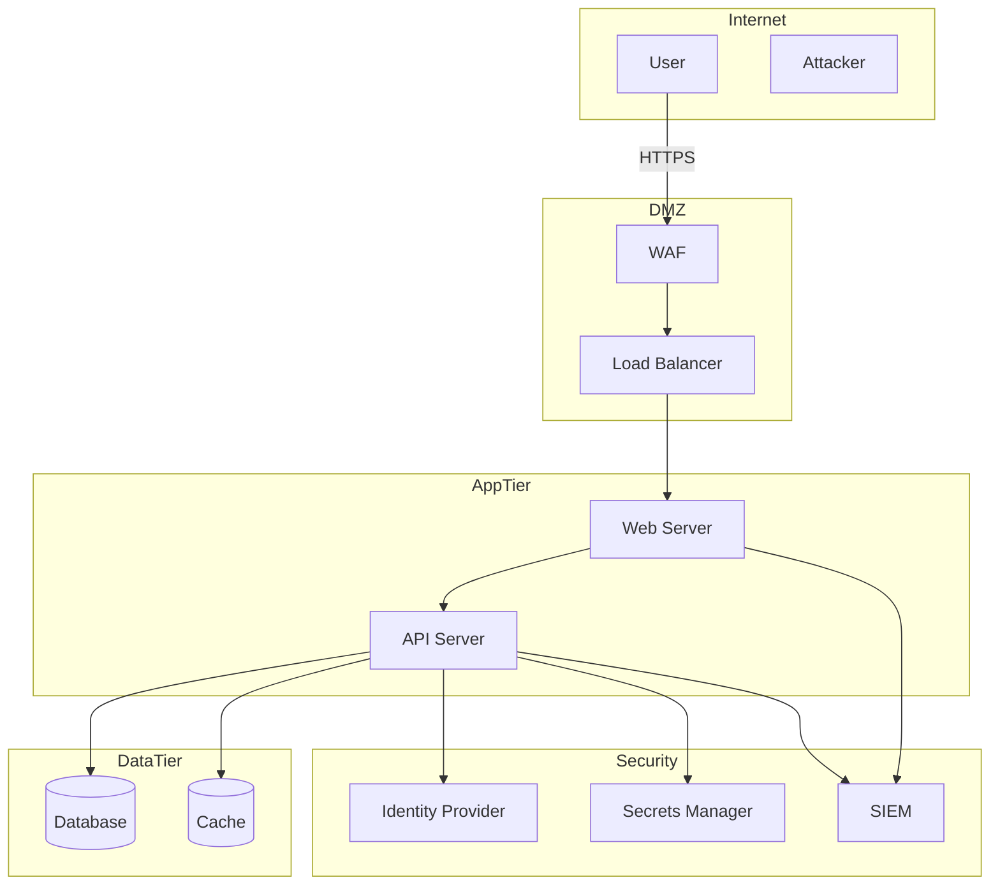

# 🟡 Secure Design Skill

## Purpose
Design secure systems, architectures, and solutions following security best practices and frameworks.

## Capabilities

### 1. Security by Design
Apply security principles from the start:
- Defense in depth
- Least privilege
- Fail secure
- Separation of duties
- Complete mediation
- Open design
- Psychological acceptability

### 2. Architecture Patterns
Recommend secure architecture patterns:

#### Authentication Patterns
- OAuth 2.0 / OIDC
- SAML
- mTLS
- API Keys with rotation
- JWT with proper validation

#### Authorization Patterns
- RBAC (Role-Based Access Control)
- ABAC (Attribute-Based Access Control)
- ReBAC (Relationship-Based Access Control)
- Policy-as-Code (OPA)

#### Data Protection Patterns
- Encryption at rest
- Encryption in transit
- Tokenization
- Data masking
- Key management

#### Network Patterns
- Zero Trust Network
- Micro-segmentation
- Service mesh
- API Gateway
- WAF/DDoS protection

### 3. Framework Alignment
Align designs with security frameworks:
- NIST Cybersecurity Framework
- ISO 27001
- SABSA
- TOGAF Security
- CIS Controls

### 4. Compliance Integration
Incorporate compliance requirements:
- GDPR
- HIPAA
- PCI DSS
- SOC 2
- FedRAMP

## Usage

### Design New System
When user requests new system design:
1. Gather requirements
2. Identify security requirements
3. Apply security patterns
4. Create threat model
5. Document security controls
6. Generate architecture diagram

### Review Existing Design
When user provides existing design:
1. Analyze current state
2. Identify security gaps
3. Recommend improvements
4. Prioritize changes
5. Provide implementation guidance

### Secure API Design
When designing APIs:
1. Authentication mechanism
2. Authorization model
3. Input validation
4. Rate limiting
5. Error handling
6. Logging requirements

## Output Format

### Architecture Diagram


### Security Controls Matrix
```markdown
| Layer | Control | Implementation | Status |
|-------|---------|----------------|--------|
| Network | WAF | AWS WAF | Required |
| Network | DDoS | CloudFlare | Required |
| App | AuthN | OAuth 2.0 + MFA | Required |
| App | AuthZ | RBAC | Required |
| Data | Encryption | AES-256 | Required |
| Data | Key Mgmt | AWS KMS | Required |
```

### Security Requirements
```markdown
## Authentication
- AUTH-001: System SHALL implement OAuth 2.0 with PKCE
- AUTH-002: System SHALL require MFA for all users
- AUTH-003: System SHALL implement session timeout (15 min)

## Authorization
- AUTHZ-001: System SHALL implement RBAC
- AUTHZ-002: System SHALL enforce least privilege
```

## Integration with Purple Team

### Red Team Collaboration
- Share architecture for attack planning
- Receive feedback on weaknesses
- Update designs based on findings

### Blue Team Collaboration
- Define monitoring requirements
- Specify logging needs
- Document detection opportunities

## Commands
- `/design-secure [system]` - Design secure architecture
- `/secure-api [api]` - Design secure API
- `/security-controls [system]` - Generate controls matrix
- `/compliance-map [standard]` - Map to compliance framework
