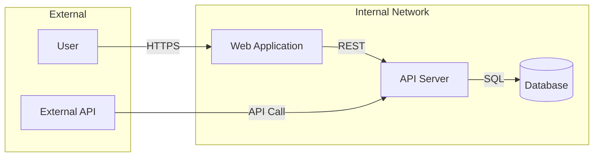

# 🟡 Threat Model Workflow

## Overview
This workflow guides you through creating a comprehensive threat model for a system or application.

## Steps

### 1. Gather System Information
Collect the following information about the target system:
- System name and purpose
- Components and their interactions
- Data flows and data types
- Users and access patterns
- Trust boundaries

### 2. Create Data Flow Diagram
Generate a DFD showing:
- External entities (users, external systems)
- Processes (applications, services)
- Data stores (databases, files)
- Data flows with labels
- Trust boundaries



### 3. Perform STRIDE Analysis
For each component and data flow, analyze:

#### 🎭 Spoofing (Authentication)
- Can an attacker pretend to be someone else?
- Mitigations: MFA, strong authentication, certificate pinning

#### ✏️ Tampering (Integrity)
- Can data be modified without detection?
- Mitigations: Digital signatures, input validation, integrity checks

#### 🚫 Repudiation (Non-repudiation)
- Can actions be denied?
- Mitigations: Audit logging, digital signatures, timestamps

#### 📤 Information Disclosure (Confidentiality)
- Can sensitive data be exposed?
- Mitigations: Encryption, access control, data masking

#### 💥 Denial of Service (Availability)
- Can the service be disrupted?
- Mitigations: Rate limiting, redundancy, auto-scaling

#### ⬆️ Elevation of Privilege (Authorization)
- Can an attacker gain unauthorized access?
- Mitigations: Least privilege, RBAC, sandboxing

### 4. Document Threats
For each identified threat, document:
- Threat ID (e.g., S-001, T-001)
- Description
- Affected component
- Impact (High/Medium/Low)
- Likelihood (High/Medium/Low)
- Risk rating
- Proposed mitigations

### 5. Generate Report
// turbo
Run the threat model generator:
```bash
python tools/custom-scripts/threat_model.py --interactive
```

### 6. Review and Validate
- Review with stakeholders
- Validate threat coverage
- Prioritize mitigations
- Create action items

## Output Files
- `threat-models/[system]-threat-model-[date].md` - Markdown report
- `threat-models/[system]-threat-model-[date].json` - JSON data

## Tips
- Focus on high-value assets first
- Consider insider threats
- Include third-party integrations
- Update threat model when system changes
